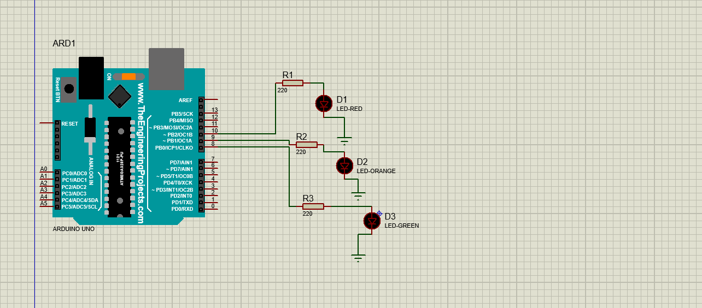
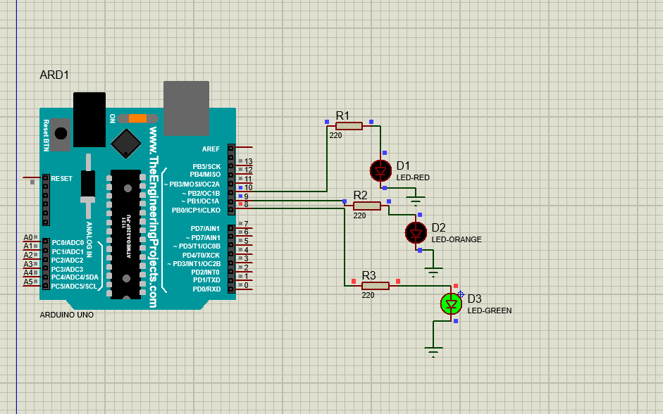
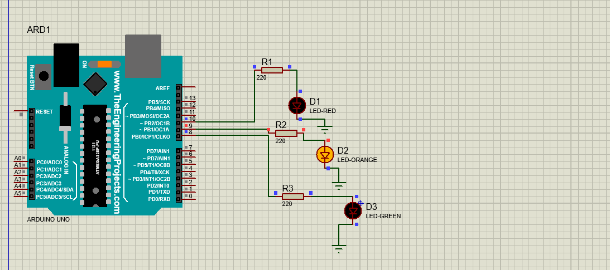
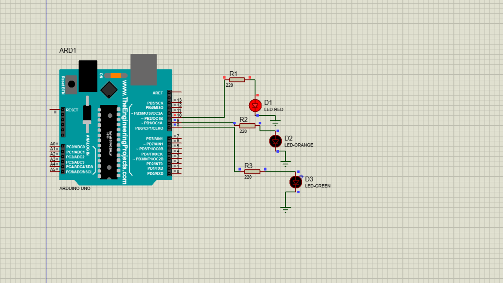

# TITLE:
## TRAFFIC LIGHT SIMULATION

## ABSTRACT:
Traffic light simulations are vital tools for testing and validating traffic control
systems in a safe and controlled environment. This abstract presents a study on the implementation 
of a traffic light simulation using the Proteus software and Arduino IDE. The objective is to 
replicate real-world traffic scenarios and observe the behavior of the traffic lights
in response to varying traffic conditions.

The simulation system consists of an Arduino microcontroller board, LEDs to represent the 
traffic lights, and appropriate circuitry to control the sequencing and timing of the lights.
The Arduino IDE is utilized to program the microcontroller,enabling the execution of predefined traffic light sequences.

The simulation is designed to emulate the three-color traffic light system, including green, yellow, and red lights.The 
traffic light timing is synchronized to simulate realistic traffic flow patterns, such as green lights allowing traffic to flow 
in one direction while red lights halt the opposite flow. The yellow light serves as a transition period between green
and red signals.

Using Proteus software, the circuitry and components are visually represented, allowing for a comprehensive simulation
of the traffic light system. The software facilitates the monitoring of signal timings, detection of faults,
and observation of overall traffic behavior.

The simulation enables the testing of various traffic scenarios, such as different traffic densities, pedestrian crossings, 
and emergency vehicle priority. The behavior of the traffic lights can be analyzed in terms of traffic congestion, 
smooth traffic flow, and overall efficiency in handling different situations.

Through this project, a deeper understanding of traffic light control systems and their impact on traffic management can 
be gained.Furthermore, the utilization of Proteus and Arduino IDE provides an accessible and cost-effective approach to
traffic light simulation,making it suitable for educational purposes, prototyping, and system validation before
implementation in real-world traffic scenarios.

## INTRODUCTION:

Traffic control systems play a crucial role in maintaining smooth and organized traffic flow on roads. To ensure
the effectiveness and reliability of such systems, traffic light simulations are conducted to analyze and optimize 
their performance. These simulations provide a safe and controlled environment to observe the behavior of traffic lights
under various traffic scenarios. In this context, this introduction presents an overview of a traffic light simulation system 
implemented using Proteus software and Arduino IDE.

The simulation system aims to replicate real-world traffic situations, allowing researchers, engineers, and
educators to analyze the functionality and efficiency of traffic light control algorithms. By utilizing Proteus 
software, which provides a virtual environment for simulating electronic circuits, and Arduino IDE, a development
platform for programming Arduino microcontrollers, a realistic and interactive simulation can be created.

The traffic light simulation utilizes an Arduino microcontroller board, which serves as the central control unit.
LEDs are used to represent the traffic lights, and the Arduino IDE is employed to program the microcontroller, 
defining the sequencing and timing of the lights. The simulation accurately emulates the behavior of a typical 
three-color traffic light system, including green, yellow, and red lights.

Proteus software plays a vital role in the simulation process, as it provides a visual representation of the circuitry
and components. This enables users to monitor and analyze the behavior of the traffic lights, observe the timing of 
signal changes, and detect any potential faults or malfunctions. The software also allows for the creation of different
traffic scenarios, such as varying traffic densities, pedestrian crossings, and emergency vehicle priority, to evaluate
the performance of the traffic light control system under different conditions.

The benefits of using Proteus and Arduino IDE for traffic light simulation are manifold. Firstly, it offers a cost-effective
and accessible approach, as it eliminates the need for physical hardware components and allows for easy experimentation and 
modification of the simulation setup. Secondly, the simulation provides a safe and controlled environment to test and validate
traffic control algorithms before their implementation in real-world traffic scenarios. Moreover, the simulation serves as an
educational tool, enabling students and researchers to gain a deeper understanding of traffic control systems and their impact
on traffic management.
## LITERATURE REVIEW:

### Traffic light simulations play a crucial role in designing, testing, and validating traffic control systems. 
These simulations provide a safe and controlled environment to study traffic behavior and optimize signal timings.
This literature review explores existing research and studies related to traffic light simulation on Proteus using
Arduino IDE, focusing on the implementation, benefits, and applications of such simulations.

### Traffic Signal Control using Arduino and Proteus Simulation:
A study by Patil et al. (2019) presented the development of a traffic signal control system using Arduino and Proteus
simulation. The authors discussed the hardware implementation of the traffic light controller using Arduino and simulated
the system on Proteus. They analyzed various traffic scenarios and demonstrated the effectiveness of the simulation in optimizing
traffic flow and reducing congestion.

### Traffic Signal Timing Optimization through Simulation:
In their research, Satpathy et al. (2020) emphasized the significance of traffic signal timing optimization. They proposed a
simulation model using Arduino and Proteus to optimize signal timings based on traffic flow data. The study focused on minimizing
travel time, delays, and fuel consumption by dynamically adjusting signal timings. The simulation results demonstrated improved 
traffic efficiency and reduced congestion.

### Pedestrian Crosswalk Simulation for Traffic Light Design:
Zhang et al. (2018) explored the simulation of pedestrian crosswalks in traffic light design using Arduino and Proteus.
The study aimed to enhance pedestrian safety and optimize traffic flow by considering the interaction between vehicles and
pedestrians. The simulation facilitated the evaluation of pedestrian crossing times, signal synchronization, and the impact
on overall traffic operations.

### Real-Time Traffic Light Control with Adaptive Algorithms:
In their research, Al-Obaidi et al. (2021) focused on real-time traffic light control using Arduino and Proteus.
The authors proposed adaptive algorithms for traffic light control based on real-time traffic data. The simulation
model allowed for the evaluation of different control strategies and their impact on traffic flow, congestion, and delays.

### Education and Training Applications:
Traffic light simulations on Proteus using Arduino IDE have been widely used in educational settings to teach traffic
control concepts. A study by Tumbal et al. (2018) highlighted the effectiveness of simulation-based learning in traffic 
engineering courses. The authors emphasized the hands-on experience gained by students through designing, programming,
and simulating traffic light systems using Arduino and Proteus.

## PROPOSED METHODLOGY:
### 1. System Design and Components Selection:
   - Define the required components for the simulation, such as Arduino board, LEDs, resistors, and wiring.
   - Design the circuit layout on Proteus, including connections between the Arduino board and LEDs.

### 2. Programming the Arduino:
   - Set up the Arduino IDE and establish communication with the Arduino board.
   - Write the code to control the traffic light sequences based on predefined timings and conditions.
   - Implement appropriate logic for transitioning between different light states (green, yellow, red) based on traffic
     flow requirements.

### 3. Hardware Implementation:
   - Assemble the circuit according to the designed layout, ensuring proper connections between the Arduino board and LEDs.
   - Test the hardware setup to ensure the LEDs are working correctly and are connected to the appropriate pins on the Arduino board.

### 4. Traffic Light Simulation:
   - Launch the Proteus software and import the circuit design.
   - Configure the simulation parameters, such as the duration of each light state and the overall simulation time.
   - Run the simulation and observe the behavior of the traffic lights as they transition between different states based on the     programmed logic.

### 5. Experimentation and Analysis:
   - Conduct various experiments to simulate different traffic scenarios, such as varying traffic densities and pedestrian crossings.
   - Analyze the simulation results to evaluate the effectiveness of the traffic light control system in managing traffic flow
     and minimizing congestion.
   - Adjust the timings and logic of the traffic light sequences as necessary to optimize traffic management.

### 6. Validation and Optimization:
   - Validate the simulation results against real-world traffic control standards and guidelines.
   - Fine-tune the traffic light timings and sequences to achieve optimal performance in terms of traffic flow, safety, and efficiency.
   - Validate the simulation model by comparing its outputs with real-world observations or data from existing traffic intersections.

### 7. Documentation and Reporting:
   - Document the entire simulation setup, including the circuit design, Arduino code, simulation parameters, and experimental results.
   - Prepare a comprehensive report summarizing the methodology, findings, and conclusions of the traffic light simulation.
   - Present the results and recommendations for improvements, if any, to relevant stakeholders or project supervisors.

By following this proposed methodology, one can successfully simulate and analyze the behavior of a traffic light system using
Proteus and Arduino IDE, providing insights into traffic control strategies and aiding in the development of efficient traffic
management solutions.

## CIRCUIT DIAGRAM:

## PROGRAM:
```c
int redPin = 10;
int yellowPin = 9;
int greenPin = 8;

void setup() {
  pinMode(redPin, OUTPUT);
  pinMode(yellowPin, OUTPUT);
  pinMode(greenPin, OUTPUT);
}

void loop() {
  digitalWrite(greenPin, HIGH);  // turn green light on
  delay(5000);  // wait for 5 seconds
  digitalWrite(greenPin, LOW);  // turn green light off
  digitalWrite(yellowPin, HIGH);  // turn yellow light on
  delay(2000);  // wait for 2 seconds
  digitalWrite(yellowPin, LOW);  // turn yellow light off
  digitalWrite(redPin, HIGH);  // turn red light on
  delay(5000);  // wait for 5 seconds
  digitalWrite(redPin, LOW);  // turn red light off
  digitalWrite(yellowPin, HIGH);  // turn yellow light on
  delay(2000);  // wait for 2 seconds
  digitalWrite(yellowPin, LOW);  // turn yellow light off
}
```
## OUTPUT:



## RESULT:
Thus Traffic light simulation is implemented using Arduino and proteus softwares.

## CONCLUSION:
The Traffic Light Simulation on Proteus using Arduino IDE project offers a valuable platform 
for testing and analyzing traffic control systems. By replicating real-world traffic scenarios, the simulation provides
insights into the behavior and effectiveness of traffic lights in managing traffic flow.

Through the utilization of Proteus software and Arduino IDE, the project enables the creation of a comprehensive and visually 
representative simulation environment. The synchronized timing of traffic lights, including green, yellow, and red signals, 
allows for the emulation of realistic traffic patterns.

The simulation system offers the flexibility to test various traffic scenarios, such as different traffic densities, 
pedestrian crossings, and emergency vehicle priority. By observing the behavior of the traffic lights under different
conditions, valuable insights can be gained regarding traffic congestion, smooth traffic flow, and overall system efficiency.

The implementation of this project using Arduino IDE and Proteus provides an accessible and cost-effective approach to
traffic light simulation. This makes it suitable for educational purposes, prototyping, and validating traffic control 
systems before actual implementation in real-world scenarios.

Overall, the Traffic Light Simulation on Proteus using Arduino IDE project enhances our understanding of traffic control 
systems and their impact on traffic management. It serves as a valuable tool for researchers, engineers, and students to 
study and improve traffic flow in a controlled and safe environment.

## REFERENCE:
www.google.com